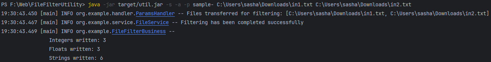
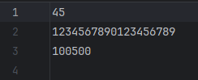
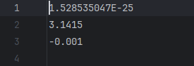
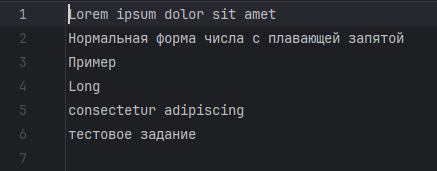
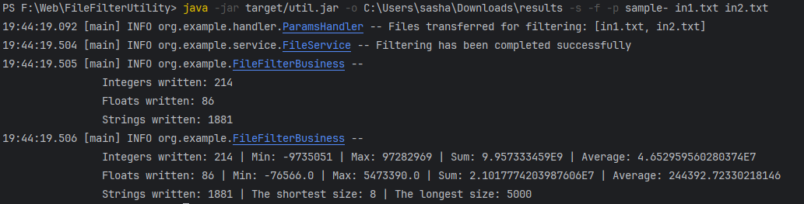
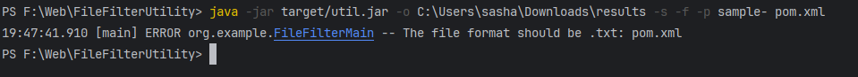

# File Filter Utility
# Особенности реализации
Утилита работает только с .txt файлами. Минимальное количество файлов для фильтрации - 1. Максимальное количество файлов не ограничено.
Использованы сторонние библиотеки для обработки переданных аргументов и для работы с файлами.

# Использованные технологии и библиотеки

## Java
Использованная версия Java - **corretto-21.0.5**

## Система сборки проекта
- В качестве системы сборки проекта был использован **Apache Maven 4.0.0**
- Для создания .jar файла с зависимостями был использован **maven-assembly-plugin 3.5.0**

## Сторонние библиотеки
* [Apache Commons Cli 1.9.0](https://mvnrepository.com/artifact/commons-cli/commons-cli) - Для обработки передаваемых аргументов
* [Apache Commons IO 2.18.0](https://mvnrepository.com/artifact/commons-io/commons-io) - Для работы с файлами
* [Project Lombok 1.18.36](https://mvnrepository.com/artifact/org.projectlombok/lombok) - Для упрощенной работы с объектами
* [Logback Classic Module 1.5.16](https://mvnrepository.com/artifact/ch.qos.logback/logback-classic) - Для логирования

# Запуск утилиты
При запуске из папки проекта:
<pre>
    mvn clean package
    java -jar target/util.jar -p test- -o results in1.txt in2.txt
</pre>

# Примеры работы утилиты
- Из приведенных в задании примера данных:
<pre>
    java -jar target/util.jar -s -a -p sample- C:\Users\sasha\Downloads\in1.txt C:\Users\sasha\Downloads\in2.txt
</pre>
**Логи результатов выполнения:**  
**sample-integers.txt**  
**sample-floats.txt**  
**sample-strings.txt**  

- На больших объемах данных при сохранении по абсолютному пути:
<pre>
    java -jar target/util.jar -o C:\Users\sasha\Downloads\results -s -f -p sample- in1.txt in2.txt
</pre>
**Логи результатов выполнения:**  

- С ошибкой при передаче неверного формата файла:
<pre>
    java -jar target/util.jar -o C:\Users\sasha\Downloads\results -s -f -p sample- pom.xml
</pre>
**Логи результатов выполнения:**  